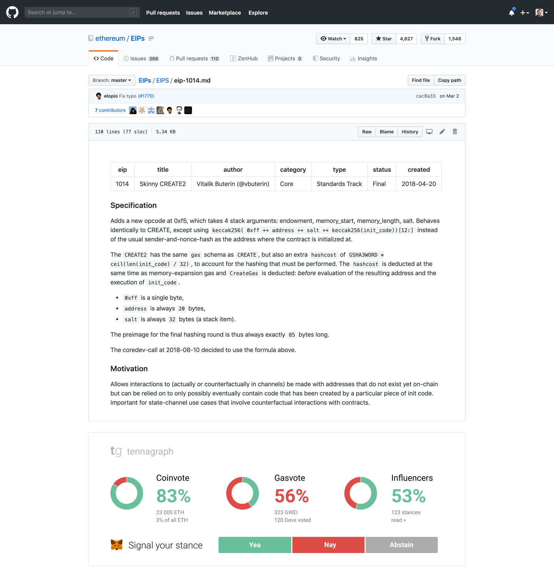

# MGP-X: $9600 for EthSignals

## The ask

EthSignals Team \(Max Semenchuk, Bohdan Malkebych, Anett Rolíková\) are requesting funds on improving of Ethereum governance through increasing the volume of signaling around EIPs and general governance stances. This is done through the app called [Tennagraph](https://tennagraph.com/) that is the hub for collecting the community sentiment \(support or opposition\) to specific proposals. It provides perspectives through:

* Coinvoting
* Gas Voting
* Rated influencer stances

## Background

The project started from the [Phil Lucsok and Griff Green presentation](https://drive.google.com/file/d/1bQiSw8UveVT_R2f3Yhla61ad6FRefptf/view) on July 2018. The working group was formed shortly. The project was funded on [Giveth](https://beta.giveth.io/campaigns/5b51bdbdf8ba4732631989f5) by Griff Green, then with the [Aragon Nest grant](https://github.com/aragon/nest/pull/66) and later on [GitCoin](https://gitcoin.co/grants/85/tennagraph-minimum-bias-ethereum-signal-aggregat-2) and [WeTrust](https://cryptounlocked.wetrust.io/tennagraph). Collectively over $43k was attracted for the development and community work. Currently, we have no legal entity and the funds are managed through the [EthSignals DAO](https://mainnet.aragon.org/#/tenna.aragonid.eth/0x77886861218199f5d98c86f4e707a071cbb82ea5). Info on the team:

* **Max Semenchuk.** Entrepreneur, Product Manager, UX Designer. Partner at [DGOV Foundation](https://dgov.foundation/), [4IRE labs](https://4irelabs.com/),  \#Decentralization, \#Holacracy, \#Lean, \#DAO. \([Twitter](https://twitter.com/maxsemenchuk)\)
* **Bohdan Malkevych.** Full Stack Web \(python, vue.js, nuxt\), Blockchain \(ethereum, solidity\) & iOS Engineer. \([Linkedin](https://www.linkedin.com/in/bohdan-malkevych-19357bb1/)\)
* **Anett Rolikova.** Has experience in marketing, community building, research. In recent months she has organized numerous Ethereum meetups, helped with organising events and has had a positive impact on the community.  \([Twitter](https://twitter.com/AnettRolikova)\)

The working group is advised by Hudson Jameson \(Ethereum Foundation\), Griff Green \(Giveth\) and Anna Rose \(Zero Knowledge\). The roles, strategy, reports and meeting notes can be found the in [the ethsignals wiki](https://ethsignals.gitbook.io/wiki/).

Find us on [Magicians Ring](https://ethereum-magicians.org/c/working-groups/signaling-ring) & [Telegram working group](https://t.me/tennagraph)

## Scope of Work

Our task is to help Ethereum Core devs, Ethereum Magicians and Ethereum Foundation to collect and analyze signals around the governance by

* Add a plugin for Chrome to[ inject voting mechanics in EIP github interface](https://www.figma.com/file/X4cetH8WVlTP3w0XmbgsEwFN/Tennagraph?node-id=896%3A1239)

* Make cleaner website with more info 
  * Add the mission statement \([example](https://coin.dance/)\)
  * Add roadmap - with potentially numbers that we want to reach out - get
  * Add “about” 
  * Add FAQs
  * Short description of EIP - but you can click on it and see it full afterwards 
  * Add socials - twitter & telegram
* Creating more awareness about most important EIPs, importance of signaling, and Tennagraph as the tool to use
  * Doing promotional campaigns in Twitter on specific EIPs \(e.g. [EIP-1559](https://ethereum-magicians.org/t/eip-1559-fee-market-change-for-eth-1-0-chain/2783/8)\)
  * Manual verification and attaching influencers stances to Tenna
  * Engaging the EIP writers in signaling promotion
  * Including overview/links in relevant media \(coindesk, eth website, [eth github](https://github.com/ethereum/wiki/wiki/Governance-compendium) and satellite resources\)
  * Arrange talks on the conferences \(e.g. web3, ethBerlin, magicians\) & podcasts \(e.g. Zero Knowledge\)
  * Allow setting signal collection bounties from EF and other parties
  * Attract advisors into popularization
  * Create an agreement with major dapps dev on signaling
  * Making public report on the work

## Preliminary monthly budget allocation

* $1500/mo. – full-stack engineer \(Bohdan\)
* $500/mo. product management & design \(Max\)
* $2000/mo. – communications managers \(Anett, Max\)
* $800/mo. – travel costs & tools

Total: $9600 for 2 months to prove our work, after 6 weeks we will propose a follow up grant.

Project Coordinator: Max Semenchuk \(email: max.semenchuk@gmail.com, telegram: maxsemenchuk\)

