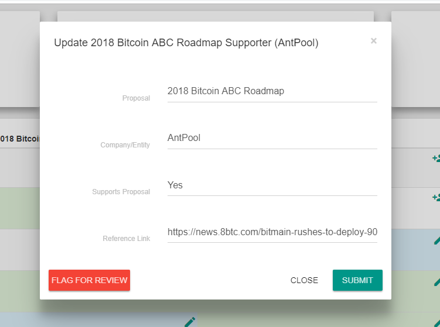

# Filter/Sorting Specifications

Milestone [1d](https://github.com/MadeofTin/nest/blob/master/grants/tennagraph/roadmap.md%20)

### User Stories

A Decision Maker wants to filter the EIPs by Status or Tags in order to investigate the communities consensus on a subset of EIPs they are interested.  
  
A Decision Maker wants to navigate to a specific EIP they already know of in order to see the communities consensus on the topic.

### Filter and Sorting Requirements

* Sort by Date
* Filter by Status
* Filter by Category
* Search with text matching any of the fields

  * EIP, Title, Status, Category, Created

  
  Searching overrides Filtering

* If a filter is set and a user types in the search bar, it should show **all** **matches regardless of what filter is selected  Defaults These filters will be selected by default Status** ☑ Draft ☑ Last Call ☑ Accepted ☐ Final ☐ Deferred

  
  
  

* **Draft** - an EIP that is open for consideration.
* **Accepted** - an EIP that is planned for immediate adoption, i.e. expected to be included in the next hard fork \(for Core/Consensus layer EIPs\).
* **Final** - an EIP that has been adopted in a previous hard fork \(for Core/Consensus layer EIPs\).
* **Deferred** an EIP that is not being considered for immediate adoption. May be reconsidered in the future for a subsequent hard fork.

### Challenges

We use a bot to pull the EIPs from the EIP repository. This is problematic for sorting as EIPs do not follow a consistent standard. One example, dates are sometimes US style and sometimes EU style. This makes programmatic sorting difficult as there isn't a way to sanitize this data consistently without the bot making assumptions it should not have to make.

### Solution

Add in the UI the ability for users to suggest when an EIP is not correctly formatted, or Updates should be made. These edits would also go through a moderation similar to the influencer statements.  

Any edits done through this process would override any edits the bot makes. The logic would be as follows.  
  
 \* If the base data has no overrides it would display as is.  
 \* If there exists an override it would show the override  
 \* It would not delete the underling data \(The bot alone maintains the base data\)  
 \* If we deleted the override it would again show the underlying bot maintained data. 

### Conclusion

The bot will continue to update the site as new EIPs are created and edited. In the case that they are formatted wrong either the user or the admin will notice them and can submit a suggestion. The filtering system can assume the rules are being followed and any needed updates would be made when the filtering system breaks.  

### Additional Notes

coin.dance has a similar feature throughout their site. The workflow is as follows

  
When submitted there is a confirmation message that it has been sent to the admin for review.

